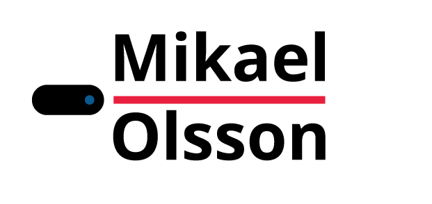

# Grafisk profil

## Färger
Du kan använda dig av följande 4 olika färger i temat.

- #E91F3E (Röd)
- #0A5990 (Blå)
- #FFFFFF (Vit)
- #000000 (Svart)

Du har även möjligheten att ändra tonvärdet på färgerna.
Ton värderna kan vara mellan 100% till 10%

## Typsnitt
Den typsnitten du behöver använda dig av är Open Sans

## Logo

